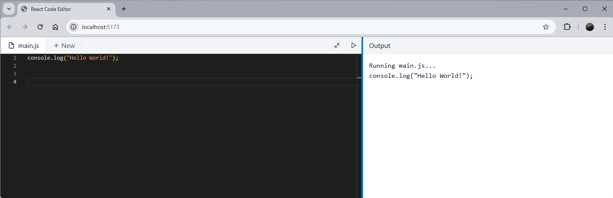

# @edusidekick/react-code-editor

A lightweight, customizable code editor component for React applications, built with Monaco Editor. This package provides a split-pane interface with code editing and output display capabilities.

## Features

- 🎨 Monaco Editor integration for powerful code editing
- ⚡ Split-pane layout with adjustable sizes
- 🌗 Light/Dark theme support
- 📁 Multi-file support with tabs
- 🔄 Live output preview
- 📱 Responsive design with automatic layout adjustment


### Screenshot



## Installation

```bash
npm install @edusidekick/react-code-editor
```

## Usage in React

```tsx
import { CodeEditor } from '@edusidekick/react-code-editor';
import type { File } from '@edusidekick/react-code-editor/types';

const DEFAULT_FILES: File[] = [
  {
    name: "main.js",
    content: 'console.log("Hello World!");',
    language: "javascript",
  }
];

function App() {
  const [files, setFiles] = useState<File[]>(DEFAULT_FILES);
  const [activeFile, setActiveFile] = useState<File>(files[0]);
  const [output, setOutput] = useState("");

  const handleFileContentChange = (content: string) => {
    setFiles(
      files.map((f) => (f.name === activeFile.name ? { ...f, content } : f))
    );
  };

  return (
    <div className="h-screen">
      <CodeEditor
        files={files}
        activeFile={activeFile}
        onFileSelect={setActiveFile}
        onFileContentChange={handleFileContentChange}
        onCreateFile={(name) => {/* handle file creation */}}
        onDeleteFile={(file) => {/* handle file deletion */}}
        output={output}
        onRun={() => {/* handle code execution */}}
      />
    </div>
  );
}
```

## Props

| Prop | Type | Description |
|------|------|-------------|
| files | `File[]` | Array of file objects to display |
| activeFile | `File` | Currently selected file |
| onFileSelect | `(file: File) => void` | Callback when a file is selected |
| onFileContentChange | `(content: string) => void` | Callback when file content changes |
| onCreateFile | `(name: string) => void` | Callback when a new file is created |
| onDeleteFile | `(file: File) => void` | Callback when a file is deleted |
| output | `string` | Output text to display in the output pane |
| onRun | `() => void` | Callback when the run button is clicked |

## Usage in Astro

```astro
---
import { CodeEditor } from '@edusidekick/react-code-editor';
---

<div class="h-screen">
  <CodeEditor
    client:load
    files={[
      {
        name: "main.js",
        content: 'console.log("Hello from Astro!");',
        language: "javascript",
      }
    ]}
    {.../* other props */}
  />
</div>
```

Note: When using in Astro, make sure to:
1. Install the `@astrojs/react` integration
2. Add the `client:load` directive to the component
3. Configure your `astro.config.mjs` to include the React integration

## Development

```bash
# Install dependencies
npm install

# Build the package
npm run build

# Run tests
npm test
```

## License

MIT © [EduSidekick](LICENSE) 